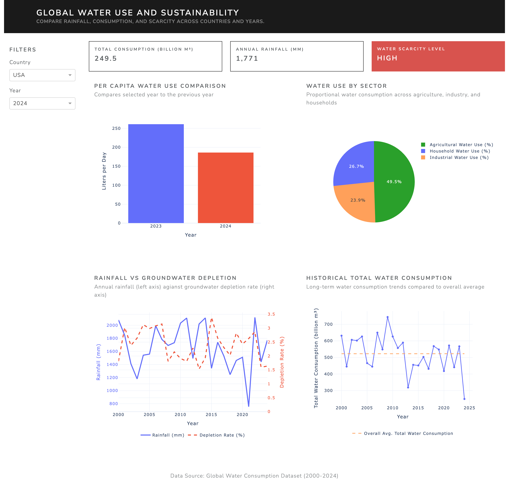
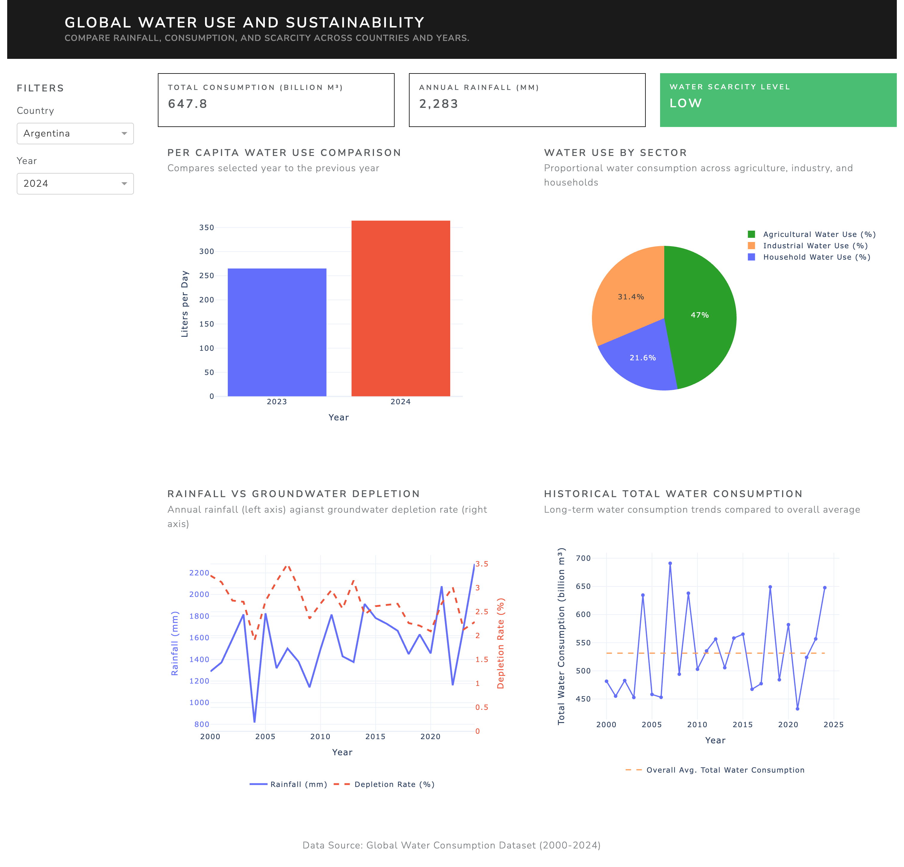

# 🌍 Global Water Use Dashboard

An interactive dashboard for visualizing global water consumption trends by country, year, and sector. Built using Dash, Plotly, and pandas.

## 📊 Overview

This dashboard provides an intuitive way to explore water use across countries from 2000 to 2024. Users can interactively filter by country and year to visualize:

- Total water consumption and rainfall
- Sector-based water use (agriculture, industry, household)
- Per capita consumption change
- Rainfall vs groundwater depletion
- Long-term consumption trends and scarcity levels

## 📸 Screenshot




## 🛠️ Built With

- [Dash](https://dash.plotly.com/)  
- [Plotly](https://plotly.com/python/)  
- [pandas](https://pandas.pydata.org/)  
- [dash-bootstrap-components](https://dash-bootstrap-components.opensource.faculty.ai/)

## 📂 Folder Structure

```
.
├── app.py                 # Main Dash app
├── requirements.txt       # Python dependencies
├── .gitignore             # Exclude temp & system files
├── README.md              # This file
├── data/
│   └── global_water.csv   # Cleaned dataset
├── screenshots/
│   └── dashboard.png      # Full-page screenshot
```

## 🚀 Getting Started

### 1. Clone the repository

```bash
git clone https://github.com/wiederstrom/water_consumption.git
cd water_consumption
```

### 2. (Optional) Create and activate a virtual environment

```bash
python3 -m venv venv
source venv/bin/activate
```

### 3. Install dependencies

```bash
pip install -r requirements.txt
```

### 4. Run the app

```bash
python app.py
```

Then open your browser and visit:  
`http://127.0.0.1:8050`

## 🌐 Deployment

https://water-consumption.onrender.com

This app is deployed using [Render](https://render.com/).  
Custom domain support and auto-redeploys via GitHub are enabled.

## 📊 Dataset

The app uses a pre-cleaned dataset containing:

- Country and Year
- Agricultural / Industrial / Household Water Use (%)
- Total Water Consumption (Billion m³)
- Rainfall and Groundwater Depletion metrics
- Per Capita Water Use
- Water Scarcity Level

## ✍️ Author

**Erik Lunde Wiederstrøm**  
Bachelor in Applied Data Science, 2025  
[LinkedIn](https://linkedin.com/in/wiederstrom)
